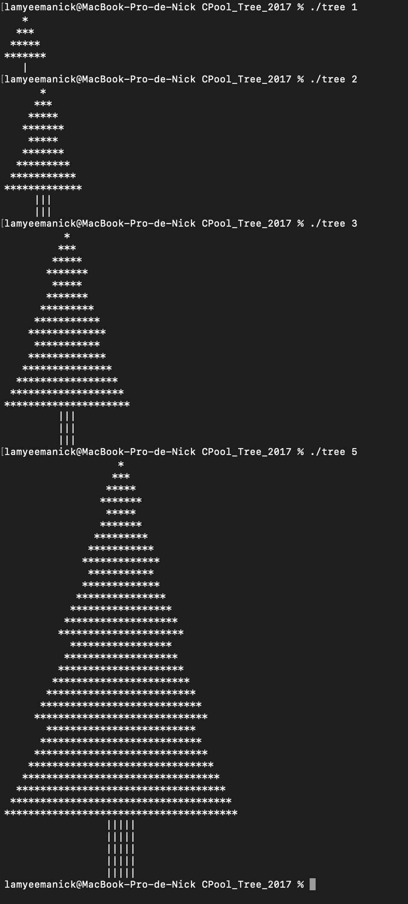

<!-- PROJECT LOGO -->
<br />
<p align="center">
  <a href="https://github.com/nicklamyeeman/CPool_Tree_2017">
    
  </a>

  <h3 align="center">CHRISTMAS TREE</h3>

  <p align="center">
    Computes a Christmas Tree of a certain size
    <br />
    <a href="https://github.com/nicklamyeeman/CPool_Tree_2017"><strong>Explore the docs »</strong></a>
    <br />
    <br />
    <a href="https://github.com/nicklamyeeman/CPool_Tree_2017/issues">Report Bug</a>
    ·
    <a href="https://github.com/nicklamyeeman/CPool_Tree_2017/issues">Request Feature</a>
  </p>
</p>


<!-- TABLE OF CONTENTS -->
## Table of Contents

* [About the Project](#about-the-project)
  * [Built With](#built-with)
* [Getting Started](#getting-started)
  * [Prerequisites](#prerequisites)
  * [Installation](#installation)
* [Usage](#usage)
* [Roadmap](#roadmap)
* [Contributing](#contributing)
* [Contact](#contact)
* [Acknowledgements](#acknowledgements)


<!-- ABOUT THE PROJECT -->
## About The Project

This project is the first project at Epitech school after 1 week of discovery of C programming. 
The only usable system function is "write", that's why some system functions have been re-coded for this project.

### Built With

* [C]


<!-- GETTING STARTED -->
## Getting Started

To get a local copy up and running follow these simple steps.

### Prerequisites

Having a C compiler (gcc) and the capacity to use make from a Makefile

### Installation

1. Clone the repo
```sh
git clone https://github.com/nicklamyeeman/CPool_Tree_2017.git
```
2. Compile it
```sh
make
```


<!-- USAGE -->
## Usage

### Example

```sh
./tree 1
```

Sizes [1 - 2 - 3 - 5] :
<br/>

<br/>


<!-- ROADMAP -->
## Roadmap

See the [open issues](https://github.com/nicklamyeeman/CPool_Tree_2017/issues) for a list of proposed features (and known issues).


<!-- CONTRIBUTING -->
## Contributing

Contributions are what make the open source community such an amazing place to be learn, inspire, and create. Any contributions you make are **greatly appreciated**.

1. Fork the Project
2. Create your Feature Branch (`git checkout -b feature/AmazingFeature`)
3. Commit your Changes (`git commit -m 'Add some AmazingFeature'`)
4. Push to the Branch (`git push origin feature/AmazingFeature`)
5. Open a Pull Request


<!-- CONTACT -->
## Contact

Nick LAM YEE MAN - [@nickauteen](https://twitter.com/nickauteen) - nick.lam-yee-man@epitech.eu

Project Link: [https://github.com/nicklamyeeman/CPool_Tree_2017](https://github.com/nicklamyeeman/CPool_Tree_2017)


<!-- ACKNOWLEDGEMENTS -->
## Acknowledgements

* [Best-README Template](https://github.com/othneildrew/Best-README-Template)


<!-- MARKDOWN LINKS & IMAGES -->
<!-- https://www.markdownguide.org/basic-syntax/#reference-style-links -->
[contributors-shield]: https://img.shields.io/github/contributors/nicklamyeeman/repo.svg?style=flat-square
[contributors-url]: https://github.com/nicklamyeeman/repo/graphs/contributors
[forks-shield]: https://img.shields.io/github/forks/nicklamyeeman/repo.svg?style=flat-square
[forks-url]: https://github.com/nicklamyeeman/repo/network/members
[stars-shield]: https://img.shields.io/github/stars/nicklamyeeman/repo.svg?style=flat-square
[stars-url]: https://github.com/nicklamyeeman/repo/stargazers
[issues-shield]: https://img.shields.io/github/issues/nicklamyeeman/repo.svg?style=flat-square
[issues-url]: https://github.com/nicklamyeeman/repo/issues
[license-shield]: https://img.shields.io/github/license/nicklamyeeman/repo.svg?style=flat-square
[license-url]: https://github.com/nicklamyeeman/repo/blob/master/LICENSE.txt
[linkedin-shield]: https://img.shields.io/badge/-LinkedIn-black.svg?style=flat-square&logo=linkedin&colorB=555
[linkedin-url]: https://linkedin.com/in/nicklamyeeman
[product-screenshot]: images/screenshot.png
